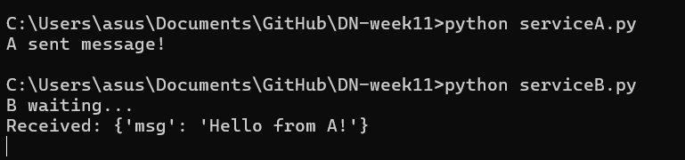
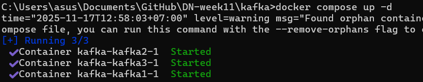

### Tạo 2 ứng dụng trao đổi dữ liệu với nhau thông qua Kafka

### Nâng cấp Kafka thành cluster gồm 3 máy.

### Kiểm tra trong 3 máy trong cụm, máy nào làm leader.

Sau khi dừng docker stop kafka-kafka3-1 thì Patrion bầu leader mới là 1
--

--
